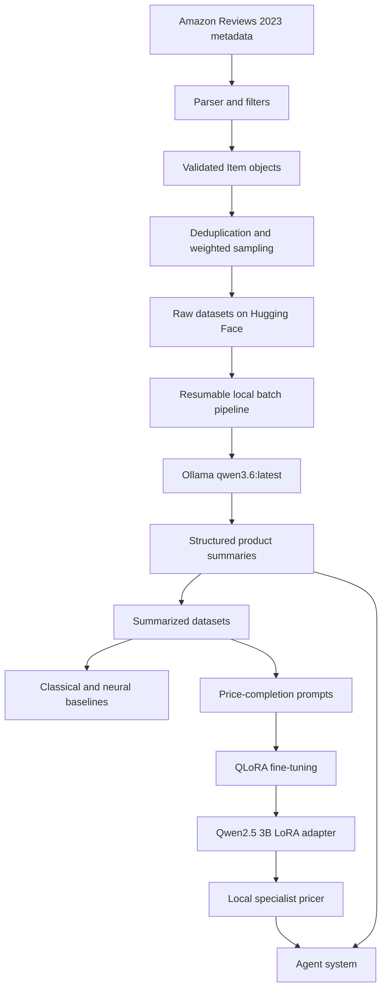

# PricerProject: Complete Technical Guide

This document explains the entire `PricerProject` repository as it exists now. It covers the original product-data pipeline, local Qwen summarization, classical and neural price estimators, QLoRA fine-tuning, local inference, evaluation utilities, and the multi-agent deal-finding layer.

The project is experimental and notebook-driven. Some paths are complete and tested; others are reference implementations that still require models, vector stores, credentials, or conversion away from hosted APIs. Those distinctions are called out explicitly below.

## 1. Executive summary

PricerProject is designed to answer a deceptively difficult question:

> Given a product description, what should the product cost?

It approaches that problem in several stages:

1. Download raw Amazon product metadata.
2. Parse, filter, clean, deduplicate, and sample product records.
3. Use local Qwen 3.6 to rewrite noisy metadata into concise descriptions.
4. Create supervised prompts whose completion is the known price.
5. Compare simple, classical ML, neural, general-LLM, and fine-tuned-LLM estimators.
6. Fine-tune Qwen2.5 3B with QLoRA for specialized price prediction.
7. Wrap predictors in agents that can scan deals, estimate value, and notify a user.

The working local path at the current checkpoint is:

```text
raw product description
  -> Ollama qwen3.6:latest preprocessing
  -> structured product description
  -> Qwen2.5 3B + custom LoRA adapter
  -> numeric price estimate
```

The local machine has an NVIDIA GeForce RTX 3090 with 24 GB of VRAM. Modal is no longer used for pricing inference.

## 2. End-to-end architecture



There are two distinct Qwen roles:

| Job | Model | Interface |
|---|---|---|
| Rewrite noisy metadata and provide general LLM behavior | `qwen3.6:latest` | Local Ollama server |
| Specialized learned price completion | `Qwen/Qwen2.5-3B-Instruct` plus `akshaymgupte87/price-2026-08-03_11.19.32-lite` | Transformers, PEFT, BitsAndBytes |

These models are not interchangeable. The LoRA adapter was trained for Qwen2.5 3B and cannot be attached to Qwen 3.6.

## 3. Repository map

### Primary notebooks

| File | Purpose |
|---|---|
| `notebooks/PricerProject.ipynb` | Main data engineering and model experimentation notebook. It covers ingestion, sampling, local Qwen summarization, baselines, evaluation, and local Qwen price estimation. |
| `Qlora_intro.ipynb` | Demonstrates unquantized, 8-bit, and 4-bit loading and examines LoRA concepts using Qwen2.5 3B. |
| `Qlora_Training.ipynb` | Performs the actual QLoRA supervised fine-tuning run and evaluates the resulting adapter. |
| `notebooks/Agentify_Pricer.ipynb` | Incrementally wraps preprocessing and specialist pricing in agents and verifies local execution. |
| `sample.ipynb` | Minimal sample notebook unrelated to the core pipeline. |

### Core pricing package

| File | Purpose |
|---|---|
| `pricer/items.py` | Defines the canonical product `Item` and its training prompt format. |
| `pricer/parser.py` | Loads and normalizes Amazon metadata, cleans text, parses weights, and rejects unsuitable records. |
| `pricer/loaders.py` | Resource-aware category loading and bounded multiprocessing. |
| `pricer/batch.py` | Resumable local Ollama summarization in 1,000-item batches. |
| `pricer/evaluator.py` | Concurrent prediction evaluation and Plotly reports. |

### Local fine-tuned inference

| File | Purpose |
|---|---|
| `llama.py` | Despite its historical name, loads Qwen2.5 3B and the custom LoRA adapter locally. |
| `pricer_ephemeral.py` | Builds a pricing prompt, calls the shared local model, and parses a float. It no longer uses Modal. |

### Agent package

The `agents/` directory contains logging, deal models, predictors, orchestration, and notification code. Some files duplicate older utilities from `pricer/`, reflecting the project's notebook/course evolution.

### Tests and utilities

| File | Purpose |
|---|---|
| `tests/test_parser.py` | Tests weight conversion and resilience to malformed product details. |
| `tests/test_batch.py` | Tests concurrent local batch execution and valid single-writer JSONL output. |
| `util.py` | Sequential compatibility adapter for notebooks; delegates to `pricer/evaluator.py`. |
| `README.md` | Quick-start, concise architecture map, dashboard workflow, API, and operational guidance. |

## 4. Environment and hardware

The intended interpreter is:

```text
C:\Users\aksha\PycharmProjects\PricerProject\.venv\Scripts\python.exe
```

The verified local stack includes:

- NVIDIA GeForce RTX 3090, 24 GB VRAM.
- PyTorch `2.12.1+cu130`.
- CUDA available with compute capability `(8, 6)`.
- Python 3.14 project configuration.
- Transformers, PEFT, TRL, BitsAndBytes, Datasets, LiteLLM, scikit-learn, XGBoost, Plotly, and Jupyter.

`pyproject.toml` declares Python `>=3.14`, PyTorch 2.12.1 from the CUDA 13.0 index, and Transformers between 5.2 and 5.5.

There are two virtual-environment directories in the repository. The `.venv` environment is the one verified with CUDA and the required model libraries. Older notebook output contains paths to a different `venv` and even an earlier `PricerProje` directory name; those saved paths should not be treated as current configuration.

## 5. The `Item` data model

`pricer.items.Item` is the central representation passed through the pipeline. It is a Pydantic model with these fields:

| Field | Meaning |
|---|---|
| `title` | Original product title. |
| `price` | Ground-truth product price. |
| `category` | Source Amazon category. |
| `full` | Cleaned but still detailed source text. |
| `weight` | Parsed weight in pounds, or zero when unavailable. |
| `summary` | Concise Qwen-generated product description. |
| `prompt` | Supervised fine-tuning prompt including its price completion. |
| `id` | Temporary positional ID used by the batch pipeline. |

The supervised prompt format is:

```text
What does this cost to the nearest dollar?

<structured product description>

Price is $<rounded price>.00
```

For evaluation, `test_prompt()` removes the answer but retains the `Price is $` prefix.

`Item.push_to_hub()` and `Item.from_hub()` serialize and reconstruct train, validation, and test splits through Hugging Face Datasets.

## 6. Raw data source and schema normalization

The raw source is the `McAuley-Lab/Amazon-Reviews-2023` Hugging Face dataset. The project works with metadata files such as:

```text
raw/meta_categories/meta_Appliances.jsonl
```

The original dataset-script path is no longer supported by Datasets 5.x. `pricer/parser.py` therefore downloads raw JSONL with `hf_hub_download()`, iterates over it directly, and normalizes every row into a fixed `Features` schema.

Normalization handles nullable and irregular values:

- Lists default to empty lists.
- Prices are converted to strings before later numeric parsing.
- Dictionaries and other structured values are serialized as JSON strings.
- Images and videos are reduced to known subfields.
- Invalid JSON lines or structurally malformed records are skipped.

## 7. Parsing and filtering rules

The parser turns raw metadata into validated `Item` instances.

### Price constraints

Products are retained only when the price is numeric and between:

```text
$0.50 and $999.49
```

This bounds the learning problem and removes missing, free, malformed, or extreme-price products.

### Text cleaning

The `scrub()` function combines title, description, features, and details while:

- Removing fields such as part numbers, best-seller rank, and battery flags.
- Collapsing excessive whitespace.
- Limiting each source section to 3,000 characters.
- Limiting the combined text to 4,000 characters.
- Removing long uppercase-alphanumeric identifiers that resemble product codes.

A record must retain at least 600 characters after cleaning.

### Weight parsing

`get_weight()` normalizes product weight to pounds. It accepts:

- pound/pounds and lb/lbs;
- ounce/ounces and oz;
- grams and g;
- milligrams and mg;
- kilograms and kg;
- Amazon-style values such as `25 hundredths of pounds`.

Missing or malformed weights return `0.0` instead of rejecting an otherwise valid item.

## 8. Resource-aware category loading

`pricer/loaders.py` is designed to avoid the memory and file-handle failures common when processing large Arrow datasets in notebooks.

The main notebook processes these eight categories sequentially:

1. Automotive
2. Electronics
3. Office Products
4. Tools and Home Improvement
5. Cell Phones and Accessories
6. Toys and Games
7. Appliances
8. Musical Instruments

Only one large source category stays open at a time. Within a category, parsing may run in multiple processes.

### Adaptive worker selection

`recommended_worker_count()` considers:

- available logical CPUs;
- physical CPU cores when `psutil` is available;
- available system memory;
- a 2 GB memory reserve;
- a conservative 512 MB budget per worker;
- dataset size, with approximately one worker per 25,000 records.

The user may request a worker count, but it is capped by the detected safe resource limit.

### Bounded chunking

Records are materialized as ordinary Python dictionaries in chunks of 1,000. This avoids sending live Arrow slices and their memory maps into worker processes. At most two chunks per worker are queued, preventing unbounded pipe, handle, and memory growth.

## 9. Deduplication, weighted sampling, and splits

After loading, `notebooks/PricerProject.ipynb`:

1. Shuffles records with seed 42.
2. Removes duplicate titles.
3. Removes duplicate full-text descriptions.
4. Examines length, price, category, and weight distributions.
5. Selects a final sample of 820,000 products.

The weighted sample emphasizes higher-priced items using a squared normalized-price weight. Automotive is downweighted heavily and Tools and Home Improvement is downweighted moderately to reduce their dominance.

The full split is:

| Split | Rows |
|---|---:|
| Train | 800,000 |
| Validation | 10,000 |
| Test | 10,000 |

The lite split is:

| Split | Rows |
|---|---:|
| Train | 20,000 |
| Validation | 1,000 |
| Test | 1,000 |

Raw project datasets are configured under:

```text
akshaymgupte87/items_raw_full
akshaymgupte87/items_raw_lite
```

After summarization, the intended destinations are:

```text
akshaymgupte87/items_full
akshaymgupte87/items_lite
```

Some later experimentation cells intentionally load Ed Donner's published datasets to avoid waiting for every local record to be summarized and uploaded.

## 10. Local Qwen 3.6 summarization pipeline

Raw Amazon metadata is too noisy for consistent price modeling. `pricer/batch.py` uses local `qwen3.6:latest` to rewrite it into:

```text
Title: Rewritten short precise title
Category: eg Electronics
Brand: Brand name
Description: 1 sentence description
Details: 1 sentence on features
```

The Ollama server defaults to:

```text
http://127.0.0.1:11434
```

and can be overridden with `OLLAMA_HOST`.

### Batch format

Every item receives an ID. Batches contain up to 1,000 items, and request files are stored as JSONL with:

- `custom_id`;
- model tag;
- system message;
- raw product text as the user message.

The repository currently includes example/partial request and result artifacts under `jsonl/` and `full/`.

### Resumability and safety

The batch runner:

- scans existing output for completed IDs;
- ignores malformed partial lines;
- retries only unfinished items;
- appends and flushes each completed response immediately;
- uses one writer thread so concurrent responses cannot corrupt JSONL;
- saves batch state in `batches.pkl` when requested.

Python threads allow multiple Ollama HTTP requests to be in flight. `OLLAMA_CONCURRENCY` defaults to four but can be changed through the environment.

### Current Ollama generation settings

The batch request disables thinking, keeps the model alive for 30 minutes, uses temperature 0.1, and allows 200 output tokens. Unlike `agents/preprocessor.py`, `pricer/batch.py` currently does not explicitly cap `num_ctx`; adding the same 4,096-token limit would make memory behavior more predictable on the RTX 3090.

### Recorded local run

The main notebook records a 1,000-item sequential run completing in approximately 26 minutes 54 seconds, or about 1.61 seconds per item. It then creates 820 logical batches for the full 820,000-item dataset. The local repository does not contain output for all 820 batches, so the complete full summarization should be treated as unfinished or stored elsewhere.

## 11. Dataset and prompt preparation for fine-tuning

Once summaries exist, the raw `full` text and temporary IDs are removed. Each summary is converted into the price-completion prompt described earlier.

The actual training notebook currently uses:

```text
ed-donner/items_prompts_lite
```

The locally cached copy contains:

| Split | Rows |
|---|---:|
| Train | 20,000 |
| Validation | 1,000 |
| Test | 1,000 |

During the lite training run, validation is limited to the first 500 records.

## 12. Model experiments in `notebooks/PricerProject.ipynb`

The main notebook compares several approaches.

### Random and constant baselines

- A random price between 1 and 999 provides a deliberately weak baseline.
- A constant predictor returns the average training price.

These establish whether a more sophisticated model is learning anything useful.

### Numeric linear regression

A linear model uses three simple features:

- parsed weight;
- whether weight is unknown;
- summary text length.

Recorded full-data metrics include MSE around 25,616 and negative R² around -0.059, demonstrating that these simple numeric features are insufficient.

### Bag-of-words linear regression

A `CountVectorizer` selects up to 2,000 non-stop-word features from product summaries. Linear regression then maps word counts to price.

### Random forests

One random forest is trained on a 15,000-row subset. A later cell defines a full-data, 100-tree forest with all CPU cores and optional Joblib persistence. No saved random-forest artifact is currently present.

### XGBoost

An `XGBRegressor` with 1,000 estimators, learning rate 0.1, and four jobs is trained on the bag-of-words features.

### Human benchmark

The notebook writes the first 100 test summaries to headerless `human_in.csv`, reads manually entered estimates from `human_out.csv`, and evaluates human price guesses with the same framework.

### Feed-forward neural network

The notebook also builds an eight-layer PyTorch network over a 5,000-feature binary `HashingVectorizer`. It trains for two epochs with Adam and MSE loss.

### General Qwen 3.6 price estimation

A separate cell asks `qwen3.6:latest` directly to estimate a price with no fine-tuning. Thinking is disabled, output is limited to 20 tokens, temperature is zero, and seed 42 is used.

Saved notebook output reports a previous local Qwen evaluation near `$57.33` mean absolute error. The current long 10,000-item evaluation cell is recorded as started but not completed in the notebook output, so that figure should be treated as a historical result rather than a freshly verified complete run.

Hosted OpenAI, Claude, Gemini, Grok, and managed fine-tuning examples are retained mostly as disabled reference code.

## 13. Evaluation framework

`pricer/evaluator.py` is the canonical implementation for prediction and
retrieval evaluation. `agents/evaluator.py` re-exports that API for older agent
imports, while `util.py` is a thin sequential adapter retained for legacy
notebooks. Evaluation behavior is implemented in one place.

The current package evaluator:

- calls a predictor over a configurable sample;
- uses five worker threads by default;
- extracts numeric prices from string responses;
- computes absolute error, MSE, and R²;
- classifies predictions as green, orange, or red;
- produces a truth-versus-prediction Plotly scatter chart;
- plots cumulative mean absolute error with a 95% confidence interval.

Color classification considers both absolute and relative error. For example, an error below $40 or below 20% of the true price is green.

Threaded evaluation is suitable for remote or Ollama calls when the backend can handle concurrency. For a nearly full 24 GB GPU, sequential execution may be safer and more predictable.

## 14. Quantization and LoRA exploration

`Qlora_intro.ipynb` introduces model-efficient fine-tuning concepts with:

```text
Qwen/Qwen2.5-3B-Instruct
```

It compares:

- unquantized loading;
- 8-bit loading;
- 4-bit NF4 loading;
- attaching an existing PEFT adapter;
- LoRA parameter dimensions and rank.

The notebook emphasizes restarting the runtime between large model variants so previous weights do not remain allocated.

## 15. Actual QLoRA fine-tuning run

`Qlora_Training.ipynb` performs supervised fine-tuning with TRL's `SFTTrainer`.

### Lite-run configuration

| Setting | Value |
|---|---:|
| Base model | `Qwen/Qwen2.5-3B-Instruct` |
| Epochs | 1 |
| Train batch size | 32 |
| Validation batch size | 1 |
| Maximum sequence length | 256 |
| Quantization | 4-bit NF4 with double quantization |
| LoRA rank | 32 |
| LoRA alpha | 64 |
| LoRA dropout | 0.1 |
| Target modules | `q_proj`, `k_proj`, `v_proj`, `o_proj` |
| Optimizer | `paged_adamw_32bit` |
| Learning rate | `1e-4` |
| Scheduler | Cosine |
| Warmup ratio | 0.01 |
| Weight decay | 0.001 |
| Save/evaluation interval | 100 steps |
| Experiment tracking | Weights & Biases |

On the RTX 3090, compute capability 8.6 enables BF16. The recorded quantized base-model footprint is about 2,010 MB; the model with adapter is about 2,069 MB.

### Training result

The completed run reached:

- 576 optimization steps;
- one epoch;
- final recorded evaluation loss approximately `0.8404`;
- final evaluation mean token accuracy approximately `0.7059`.

The resulting private Hugging Face repository is:

```text
akshaymgupte87/price-2026-08-03_11.19.32-lite
```

The local run directory contains the final adapter and checkpoints at steps 100, 200, 300, 400, 500, and 576.

### Fresh-base evaluation requirement

`SFTTrainer` injects LoRA modules into the original base model. Loading the saved adapter back onto that same mutated object can create nested or multiple adapters and damage results. The evaluation cell therefore loads a genuinely fresh Qwen base model and attaches exactly one saved adapter.

## 16. Fine-tuning artifacts

The important completed run is:

```text
price-2026-08-03_11.19.32-lite/
```

Its root includes:

- `adapter_model.safetensors` — approximately 29.5 MB;
- `adapter_config.json`;
- tokenizer files and chat template;
- training arguments;
- a generated model card.

The adapter configuration confirms:

- base model `Qwen/Qwen2.5-3B-Instruct`;
- PEFT type LoRA;
- rank 32;
- alpha 64;
- dropout 0.1;
- attention projection targets only.

The `price-2026-08-03_11.02.04-lite` directory appears empty and is not the active adapter.

## 17. Local fine-tuned inference

### `llama.py`

The historical filename remains, but the implementation is Qwen-based.

It:

1. Checks that CUDA is available.
2. Loads the Qwen2.5 tokenizer.
3. Loads the base model in four-bit NF4 mode.
4. Attaches the custom PEFT adapter.
5. Caches model and tokenizer in module globals.
6. Generates up to eight deterministic new tokens.
7. Returns only the generated completion.

Lazy loading means importing the module does not immediately consume GPU memory. The first `generate()` call loads the model; later calls in the same process reuse it.

### `pricer_ephemeral.py`

This wrapper creates the exact pricing prompt, calls `llama.generate()`, removes commas, extracts the first number with a regular expression, and returns a float.

It no longer creates a Modal app or calls a cloud GPU. The old filename is now only historical.

The local inference path has been tested successfully on the RTX 3090.

## 18. Agent system

The agent layer turns individual predictors and services into a deal-finding workflow.

### Base `Agent` — `agents/agent.py`

`agents/agent.py` supplies names, ANSI colors, and consistent logging. It is a lightweight base class rather than a formal abstract interface.

### `Preprocessor` — `agents/preprocessor.py`

Uses `ollama/qwen3.6:latest` through LiteLLM to normalize product descriptions. For notebook use it caps context at 4,096 tokens, limits output to 200 tokens, uses temperature 0.1, disables thinking, and keeps the model warm for 30 minutes. Local cost is treated as zero.

### `SpecialistAgent` — `agents/specialist_agent.py`

Calls `pricer_ephemeral.price()` locally, which reaches the fine-tuned Qwen2.5 model. It no longer looks up Modal's missing `pricer-service` application.

### `NeuralNetworkAgent` — `agents/neural_network_agent.py`

Wraps `DeepNeuralNetworkInference`, a ten-layer residual network over 5,000 hashed text features. It expects:

```text
deep_neural_network.pth
```

That file is currently absent from the project root, so this agent cannot initialize successfully as-is.

### `FrontierAgent` — `agents/frontier_agent.py`

Implements retrieval-augmented price estimation:

1. Encode the description with `all-MiniLM-L6-v2`.
2. Query a supplied vector-store collection for five similar products.
3. Include their descriptions and prices in a prompt.
4. Ask OpenAI `gpt-5.1` for a price.

A ready collection is not created by the current agent notebook, and this path still requires OpenAI credentials and network access.

### `EnsembleAgent` — `agents/ensemble_agent.py`

Runs preprocessing, then combines:

```text
80% FrontierAgent
10% SpecialistAgent
10% NeuralNetworkAgent
```

This ensemble is defined but not fully runnable until the vector-store collection and neural-network weights are available.

### Deal models and scraping — `agents/deals.py`

`agents/deals.py`:

- reads DealNews RSS feeds for electronics, computers, and smart-home deals;
- downloads deal pages;
- cleans HTML with BeautifulSoup;
- creates typed `Deal`, `DealSelection`, and `Opportunity` Pydantic models.

This layer requires internet access and depends on the current DealNews HTML structure.

### `ScannerAgent` — `agents/scanner_agent.py`

Fetches unseen scraped deals and asks OpenAI `gpt-5-mini` to select exactly five with clear prices and strong descriptions using structured output.

### `PlanningAgent` — `agents/planning_agent.py`

Coordinates scanner, ensemble, and messaging agents. It calculates:

```text
discount = estimated value - offered price
```

and sends an alert when the best discount exceeds $50.

### `AutonomousPlanningAgent` — `agents/autonomous_planning_agent.py`

Uses OpenAI tool calling to decide when to scan, estimate, and notify. It prevents duplicate notification within a run and returns an `Opportunity` when one is surfaced.

### `MessagingAgent` — `agents/messaging_agent.py`

Can send Pushover notifications. Its richer notification path asks Claude Sonnet 4.5 through LiteLLM to write the message. This requires provider and Pushover credentials and makes an external network call.

## 19. How agents share a local model

An agent is a role, prompt, history, and set of tools—not a separate copy of model weights. Multiple agents can call the same Ollama `qwen3.6:latest` server.

The agents communicate only when orchestration code passes outputs between them:

```python
clean_description = preprocessor.preprocess(raw_description)
specialist_price = specialist.price(clean_description)
review = critic.run(
    f"Description:\n{clean_description}\n\nEstimate: ${specialist_price:.2f}"
)
```

On one RTX 3090, sequential calls are recommended. Concurrent requests add KV-cache memory, and Qwen 3.6 already nearly fills the GPU. The fine-tuned 3B Transformers model is a separate process/model allocation; when it and Ollama are warm simultaneously, Ollama may offload layers to system RAM.

## 20. `notebooks/Agentify_Pricer.ipynb` walkthrough

The current eight-cell notebook is a focused integration exercise:

1. Load environment variables and imports.
2. Display locale encoding.
3. Set UTF-8 output encoding.
4. Run a standalone Modal hello-world demonstration. This is not part of pricing and may be skipped.
5. Call the fine-tuned Qwen model directly with a pricing prompt.
6. Call the local numeric `price()` wrapper.
7. Preprocess a microphone description through `qwen3.6:latest` in Ollama.
8. Call `SpecialistAgent` locally.

The cells use `importlib.reload()` so source changes appear without restarting the kernel. Reloading `llama.py` also clears its in-process model cache, so unnecessary repeated reloads make inference slower.

## 21. Modal's current role

Modal was used in the initial learning path:

- `hello.py` still defines a Modal hello-world app.
- the old `llama.py` requested a cloud T4;
- the old ephemeral pricer ran remotely;
- the old specialist looked up `pricer-service` in Modal's `main` environment.

Pricing has now been converted to the local RTX 3090. The only active Modal example in the agent notebook is the optional hello-world cell. The `modal` dependency remains in `pyproject.toml` because that example still exists.

## 22. Tests and verified status

The current automated test suite contains six tests:

- one batch concurrency/checkpoint test;
- four weight-parsing groups covering common units, hundredths, and malformed values;
- one details-parsing test covering null, invalid JSON, and wrong-shaped JSON.

The suite was run with:

```powershell
.\.venv\Scripts\python.exe -m unittest discover -s tests -v
```

Current result:

```text
Ran 6 tests
OK
```

Additional manually verified behavior includes:

- CUDA sees the RTX 3090;
- the Qwen2.5 base and adapter load locally;
- direct fine-tuned generation works;
- numeric price parsing works;
- `SpecialistAgent().price("iPhone 10")` runs locally and returned `250.0` in the verification run;
- Qwen 3.6 preprocessing produces the requested five-field description format.

## 23. Data and artifacts currently in the workspace

| Path | Current meaning |
|---|---|
| `jsonl/0_1000.jsonl` | 1,000 saved local Qwen summarization requests. |
| `jsonl/batch_results.jsonl` | Corresponding local result/checkpoint data. |
| `full/batches/0_1000.jsonl` | Example first full-mode batch request file. |
| `full/output/0_1000.jsonl` | Example first full-mode output checkpoint. |
| `price-2026-08-03_11.19.32-lite/` | Completed current LoRA run and checkpoints. |
| `human_in.csv` | Headerless 100-item human-evaluation input generated by the notebook. |
| `human_out.csv` | Headerless human price estimates consumed by the notebook. |
| `models/` | Currently empty. |
| `data/` | Currently empty. |

Large Hugging Face base models and datasets are primarily in the user's Hugging Face cache rather than committed inside the repository.

## 24. Configuration and credentials

Depending on which sections are run, the project may read:

| Variable | Used for |
|---|---|
| `HF_TOKEN` | Private Hugging Face adapter/dataset access and uploads. |
| `WANDB_API_KEY` | Training metrics and experiment tracking. |
| `OLLAMA_HOST` | Override the local Ollama endpoint. |
| `OLLAMA_CONCURRENCY` | Number of concurrent requests in the batch summarizer. |
| `PRICER_PREPROCESSOR_MODEL` | Override the preprocessor model. |
| `OPENAI_API_KEY` | Scanner, frontier, and autonomous planning agents. |
| Anthropic/LiteLLM provider credentials | Claude message generation. |
| `PUSHOVER_USER`, `PUSHOVER_TOKEN` | Push notifications. |

Secrets should remain in `.env`, provider credential stores, or environment variables and must not be committed.

## 25. Known limitations and technical debt

1. `llama.py` and `pricer_ephemeral.py` have historical names that no longer describe their Qwen/local behavior.
2. `pricer/items.py` and `agents/items.py` are near-duplicates.
3. The full 820,000-item local summarization is not represented by complete output artifacts in this workspace.
4. `pricer/batch.py` should cap Ollama context as the agent preprocessor already does.
5. Default batch concurrency of four may not be optimal for a 23 GB model on a 24 GB GPU.
6. The full ensemble lacks `deep_neural_network.pth` and an initialized vector collection.
7. Several agents still require hosted APIs, so the complete system is not offline.
8. Deal scraping depends on external sites and their HTML structure.
11. Notebook outputs contain historical paths, incomplete long evaluations, and experiments from earlier project states.
12. The generated adapter model card demonstrates generic pipeline usage but does not accurately document the required base-plus-adapter PEFT loading path used by this project.
13. Some notebook code is exploratory and expensive, such as converting the full 800,000-row sparse matrix to a dense tensor or training a full random forest.

## 26. Reproducing the current working local path

1. Select the `.venv` interpreter.
2. Confirm CUDA:

   ```powershell
   .\.venv\Scripts\python.exe -c "import torch; print(torch.cuda.is_available(), torch.cuda.get_device_name(0))"
   ```

3. Confirm and start Ollama:

   ```powershell
   ollama list
   ollama serve
   ```

4. Ensure `qwen3.6:latest` is installed.
5. Ensure Hugging Face credentials can read the private adapter if it is not cached.
6. In `notebooks/Agentify_Pricer.ipynb`, run setup cells 0–2.
7. Skip the Modal hello cell unless specifically testing Modal.
8. Run the direct pricing, wrapper, preprocessing, and specialist cells in order.

The first call to each model is slower because weights must be loaded. Avoid reloading `llama.py` after it is warm unless its source code changed.

## 27. Recommended next steps

### Reliability

1. Add `num_ctx=4096` to `pricer/batch.py`.
2. Add unit tests for price parsing, prompt construction, and malformed model output.
3. Add an integration test that mocks the local generator and verifies `SpecialistAgent` never imports Modal.
4. Add explicit timeouts and error messages for local model startup and GPU-memory contention.

### Project organization

1. Rename `llama.py` to something such as `local_finetuned_pricer.py`.
2. Rename or remove the `ephemeral` terminology.
3. Consolidate duplicate Item and evaluator modules.
4. Turn notebook-proven steps into reproducible command-line entry points.
5. Replace the empty `README.md` with a concise introduction that links to this guide.

### Complete local agent system

1. Create a generic Ollama client that accepts per-agent system prompts.
2. Convert scanner selection, frontier reasoning, planner reasoning, and message drafting to local Qwen where appropriate.
3. Keep agent calls sequential on the RTX 3090.
4. Add a shared state/message protocol rather than allowing agents to call one another recursively.
5. Add maximum-turn and termination conditions to prevent agent loops.

### Complete the ensemble

1. Restore or retrain `deep_neural_network.pth`.
2. Build and persist the product vector store.
3. Calibrate ensemble weights on the validation set instead of keeping fixed 80/10/10 weights.
4. Compare the ensemble against the fine-tuned specialist with the same held-out test set.

## 28. Current project status

### Working and verified

- Amazon metadata parser and weight normalization.
- Adaptive loader logic.
- Resumable concurrent local batch code.
- Automated parser and batch tests.
- Qwen 3.6 local preprocessing.
- Completed Qwen2.5 3B QLoRA adapter.
- Local four-bit base-plus-adapter inference.
- Numeric price wrapper.
- Local `SpecialistAgent` with no Modal dependency.

### Present but incomplete or dependent on missing services/assets

- Complete 820,000-item Qwen summarization.
- Deep neural network agent weights.
- Frontier vector collection.
- Full ensemble execution.
- End-to-end deal scanning and notification.
- Fully local replacements for OpenAI and Claude agent calls.

The project has therefore reached a meaningful midpoint: its complete data and training design is present, the specialized local pricing model works, and the first local agent integration works. The next phase is primarily about consolidation, completing artifacts, and deciding how much of the broader agent workflow should run locally.
