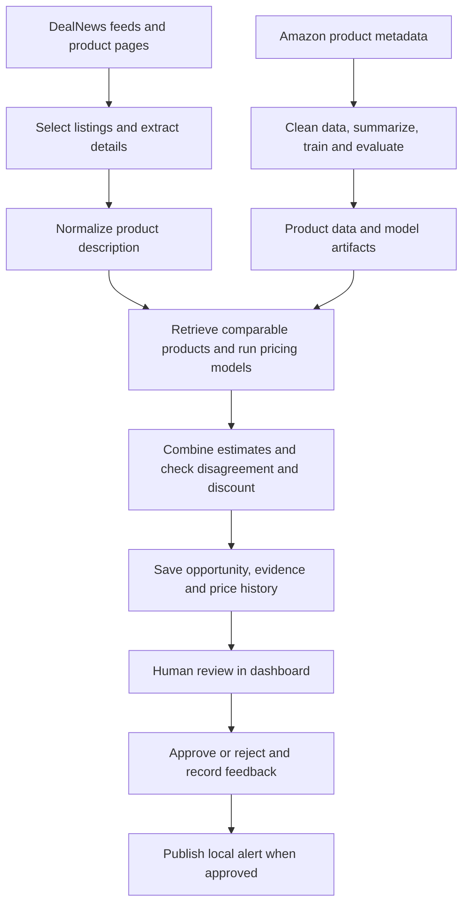

# PricerProject — Product Pricing and Deal Discovery with AI

**PricerProject estimates a product's value from its description, compares that
estimate with a seller's asking price, and presents potential deals for human
review.** It combines data preparation, machine-learning experiments, local
language models, product search, and an interactive application.

The project began as a notebook answering “Can a model predict product prices?”
It then grew into a system that uses those predictions to help evaluate real
listings. This repository contains both the research and the application built
around it.

For a recruiter or hiring manager, this is a portfolio project demonstrating the
path from raw data and model experiments to reusable Python components, an
AI-assisted workflow, evaluation, persistence, and user-facing interfaces. It
is an experimental system; the repository does not establish commercial savings
or independently benchmarked production accuracy.

## Capabilities at a glance

| Capability | How this project uses it |
|---|---|
| **Hybrid-search RAG** | Combines Chroma semantic search with BM25 keyword search, merges rankings, and reranks comparable products before giving their descriptions and prices to Qwen. |
| **Local LLMs** | Runs Qwen through Ollama for product summarization, listing selection, and price estimation. |
| **QLoRA fine-tuning** | Trains a Qwen2.5 3B pricing adapter; the fine-tuned specialist is an optional application backend. |
| **ML and ensemble pricing** | Compares classical and neural models in research; the application combines RAG, specialist, and neural estimates. |
| **Model and retrieval evaluation** | Measures price errors and retrieval quality; an optional offline LLM judge assesses comparable-product relevance. |
| **Human-in-the-loop** | Records approval, rejection, reasons, and corrected prices; explicit approval publishes a local alert. |
| **Agent workflows and guardrails** | Coordinates scanning and pricing, validates outputs, checks disagreement, and provides a resumable graph implementation. |
| **Dashboard, API, and MCP** | Exposes the application to people, other programs, and compatible AI clients. |
| **Persistence and monitoring** | Saves opportunities, price history, and feedback; provides runtime measurements and drift utilities. |

**BM25 is the keyword-search half of hybrid RAG.** It helps retrieve descriptions
containing specific brands or model identifiers, while semantic search finds
conceptually similar products. It searches the product catalog, not the web, and
does not itself estimate prices. If its index is unavailable, retrieval falls
back to semantic search.

## A concrete example

Suppose a listing advertises a microphone for **$120**. The application:

1. Extracts the product description and asking price from the listing.
2. Rewrites the description into a consistent format.
3. Searches for comparable products with known prices.
4. Asks several pricing components to estimate its value.
5. Combines their estimates and checks how strongly they disagree.
6. Presents the listing, estimates, and comparable products for review.

If the combined estimate were **$200**, the estimated discount would be **$80**,
or **40% of the estimated value**. That meets the current planner's criteria of
more than $50 savings and at least a 20% discount. A person still needs to check
condition, model, quantity, shipping, and other differences before approving an
alert.

These numbers illustrate the workflow; they are not measured project results.
An estimated value is a model prediction, not a verified sale price.

## How the project grew, and why there are several entry points

| Stage | Question being answered | What was added |
|---|---|---|
| Original `PricerProject.ipynb` | Can product descriptions predict prices? | Data cleaning, exploration, sampling, model comparisons, and evaluation |
| QLoRA notebooks | Can a smaller language model be taught this specific task? | Quantization experiments and specialist model training |
| `Agentify_Pricer.ipynb` | How can the predictors become components in a larger workflow? | Experiments calling preprocessing and pricing through agent interfaces |
| Python modules | How can the same logic be reused outside a notebook? | Importable data-processing, inference, evaluation, and agent code |
| Deal application | Can those components help identify attractive listings? | RSS scanning, orchestration, a dashboard, and human review |
| Supporting capabilities | How can the system be inspected, resumed, and accessed by other software? | Persistent history, hybrid retrieval, API, MCP, checkpoints, and monitoring |

A **notebook** is an interactive workspace containing code, explanations, and
results. A **Python module** is reusable code that other programs can import.
Moving a successful experiment into a module lets a notebook, dashboard, or API
use the same implementation.

“Agentify” describes the bridge between the research and the application. In
this project, an **agent** is a software component with a named responsibility,
such as selecting listings or estimating prices. Several agents can use the same
local language model. They do not each require a separate model, and an agent
class does not necessarily implement an autonomous reasoning loop.

Some earlier examples and filenames remain. `llama.py` now loads Qwen, while
`pricer_ephemeral.py` now performs local inference despite its earlier cloud
naming. Their names reflect the project's development history.

## Understand the project as three connected parts

### 1. Research and training

**Purpose:** discover which approaches estimate prices well.

The research pipeline takes Amazon product metadata, cleans it, removes
duplicates, selects a sample, and creates training and evaluation datasets.
A local language model can summarize noisy source text into a consistent product
description. Experiments compare simple baselines, traditional machine learning,
neural networks, and language models.

The full preparation recipe targets **820,000 products**: 800,000 for training,
10,000 for validation, and 10,000 for testing. The lite dataset uses
20,000 / 1,000 / 1,000. These are configured dataset sizes, not a claim that all
local summarization jobs have completed. Some experiments use existing published
datasets from Ed Donner to avoid waiting for local summarization.

- **Training set:** examples used to learn model parameters.
- **Validation set:** examples reserved for choosing settings and comparing changes.
- **Test set:** held-out examples used to assess the resulting predictor.

Keeping these roles separate helps avoid **data leakage**: accidentally giving
the model information about the answers it is being evaluated on. Individual
experiments document their split choices; the legacy neural experiment uses an
internal validation split from the training data.

**Outputs:** prepared datasets, summaries, fitted models, saved adapters, and
evaluation results.

### 2. Reusable pricing components

**Purpose:** accept a description and return an estimated price.

The project explores several ways to do that:

| Approach | Plain-language explanation | Why it is useful |
|---|---|---|
| Random or average-price baseline | Guess randomly or always return the training-set average | Establishes a minimum comparison point |
| Linear regression | Learns a numerical relationship between features and price | Provides a relatively simple, interpretable model |
| Bag-of-words models | Convert product text into word-count features before predicting price | Tests how much pricing information comes from vocabulary |
| Random forest / XGBoost | Combine many decision trees | Learn more complex relationships between features and price |
| Neural network | Learns a sequence of transformations from text features to a number | Provides another learned pricing approach |
| General LLM | Asks a pretrained language model to estimate the price | Provides a language-model baseline without task-specific training |
| Fine-tuned LLM | Uses a model adapted with product-description and price examples | Specializes a general model for this task |
| RAG-based predictor | Supplies similar products and known prices to the model | Grounds the estimate in retrieved evidence |
| Ensemble | Combines several estimates | Allows comparison across methods and exposes disagreement |

The application's current ensemble uses fixed weights: **80% retrieval-assisted
prediction, 10% specialist prediction, and 10% neural prediction**. These weights
are implemented choices, not evidence of an optimally calibrated combination.
Classical research models are comparison experiments; the dashboard does not run
every model listed in this table.

### 3. Deal-discovery application

**Purpose:** apply pricing to current listings and help a person review potential
deals.



The **scanner** gathers and selects listings. The **preprocessor** rewrites their
text. The **pricing agents** estimate value. The **planner** coordinates the work
and applies discount criteria. The **dashboard** shows results and collects
review decisions. SQLite stores opportunities, observations, and feedback so
they remain available after the application closes.

Automatic collection and estimation are followed by human approval before a
local alert is published. The application does not purchase products.

## The models and tools: what each one does

### Language models and inference

An **LLM (large language model)** is a model trained to process and generate text.
Here it is used for summarizing descriptions, extracting structured listing
information, estimating prices, and optionally judging retrieved comparables.
**Inference** means using an already-trained model to produce an output.

| Name | Role in this project |
|---|---|
| `qwen3.6:latest` | General local model used through Ollama for tasks such as summarization and pricing |
| Ollama | Runs and serves local language models; it is the model runtime, not the model itself |
| `Qwen/Qwen2.5-3B-Instruct` | Separate base model used for the fine-tuned pricing specialist; “3B” refers to roughly three billion parameters |
| Transformers, PEFT, BitsAndBytes | Libraries used to load the specialist model, attach its adapter, and reduce memory requirements |
| LiteLLM | A Python interface used by several agents to call language models |
| PyTorch | Framework used for neural models and training |
| Hugging Face | Source and storage for datasets, pretrained models, and adapters |

The dashboard's specialist defaults to the Ollama backend. Setting
`PRICER_SPECIALIST_BACKEND=finetuned` selects the Qwen2.5 adapter path instead.
The two Qwen models have different roles and architectures: a Qwen2.5 adapter
cannot be attached to Qwen 3.6.

### Fine-tuning, LoRA, and QLoRA

**Fine-tuning** means further training a pretrained model on examples for a
particular task. Here an example pairs a product description with its price.
This differs from **prompting**, which changes the instructions or information
given to the model without training its parameters.

**LoRA (Low-Rank Adaptation)** trains a small set of additional parameters while
leaving the base model largely frozen. The saved **adapter** contains those
learned additions and must be loaded with a compatible base model.

**Quantization** stores model values at lower numerical precision to reduce
memory usage. **QLoRA** combines a quantized base model with LoRA training, making
specialization feasible on more limited GPU hardware.

The technical guide records a local Qwen2.5 3B QLoRA run on an RTX 3090 with 24 GB
of GPU memory: a lite training dataset, one epoch, and 576 optimization steps.
That is evidence of a recorded training run, not a claim about dollar accuracy
on current listings. Training loss and token accuracy do not directly measure
price-estimation error.

### RAG and product search

**RAG (Retrieval-Augmented Generation)** means finding relevant information and
giving it to a language model as context before it answers. Here the retrieved
information is comparable products and their prices.

RAG supplies evidence at inference time; fine-tuning changes learned model
behavior during training. They address different needs and can be combined.

| Term | Meaning in this project |
|---|---|
| Embedding | A numerical representation of a product description used to compare similarity |
| Embedding model | `all-MiniLM-L6-v2` converts descriptions into those numerical representations |
| Vector store / Chroma | Stores embeddings and searches for nearby product descriptions |
| Dense retrieval | Finds similar descriptions using embedding similarity |
| BM25 / lexical retrieval | Finds descriptions using matching words; useful for brands and model identifiers |
| Hybrid retrieval | Combines embedding-based and word-based search |
| Reciprocal Rank Fusion (RRF) | Combines search results using their ranking positions |
| Reranking | Reorders the candidate products with a more detailed relevance comparison |
| Cross-encoder | A model that examines the query and candidate together for reranking |
| Top-K | The first K results returned by a search or ranking stage |
| Metadata filtering | Restricts candidates by fields such as category, brand, or condition |
| Query expansion | Creates additional search formulations to improve retrieval coverage |

The retrieved products are presented as supporting evidence. Similar wording
alone does not guarantee a valid price comparison: condition, specifications,
quantity, and model generation matter.

## What “LLM evaluation” means here

An **evaluation**, often shortened to **eval**, is a repeatable way to measure
whether a model or workflow performs its task well. Getting a plausible-looking
answer is not enough. This project has several separate evaluation questions.

### A. Is the estimated price close to the known price?

The shared evaluator runs a predictor on held-out products and compares its
estimates with their recorded prices. Those labels provide a reference for the
experiment; they are not necessarily today's market value.

| Metric | What it tells you |
|---|---|
| MAE — mean absolute error | Average error in dollars, regardless of whether the estimate is too high or too low |
| MSE — mean squared error | Average squared error; large mistakes receive a stronger penalty |
| RMSE — root mean squared error | Square root of MSE; emphasizes large errors while returning to dollar units |
| R² | How the predictions compare with a constant mean-price reference on the evaluation set; it can be negative |
| Signed bias | Whether estimates tend to be too high or too low on average |

For example, errors of $10, $20, and $30 have an MAE of $20. That does not mean
every prediction is within $20. The offline evaluator and application feedback
scorecard expose different subsets of these metrics.

A meaningful comparison uses the same held-out products and records the dataset,
model, prompt, settings, and evaluated sample size. The guide includes historical
scores, but they are not presented here as a fresh benchmark or a ranking of
models tested under identical conditions.

### B. Did retrieval find useful comparable products?

A pricing model can receive poor evidence even when its output looks reasonable.
Retrieval evaluation examines the search stage separately:

| Metric | Question it answers |
|---|---|
| Precision@K | Of the top K products retrieved, how many are relevant? |
| Recall@K | Of the known relevant products, how many appear in the top K? |
| Reciprocal rank | How near the top is the first relevant result? |
| nDCG | Are highly relevant products ranked ahead of less relevant ones? |

The project provides metric utilities. These require relevance labels to support
a meaningful benchmark; implementing a metric is not the same as completing a
labelled evaluation of the whole catalog.

### C. What is an LLM-as-judge?

An **LLM-as-judge** uses a language model to assess another part of the system.
The optional `RAGJudge` scores whether a retrieved product is a useful comparable,
including category, specification compatibility, and condition mismatch.

This is a qualitative diagnostic. A judge model can also be wrong, so its score
is not the ground-truth product price or a substitute for human-labelled tests.

### D. Does the application help reviewers?

The application records approvals, rejections, reasons, and corrected prices.
These support an evaluation of actual reviewed opportunities, including pricing
error against human corrections. An approval rate measures reviewer acceptance;
it does not by itself prove price accuracy or realized savings. The quality of
these measurements depends on consistent, independent human review.

### E. Are software tests the same as model evaluations?

No. **Unit and regression tests** check software behavior: parsing, checkpoint
handling, database persistence, API access, guardrails, and workflow failures.
Many isolate dependencies with simulated responses.

**Model evaluations** measure predictions or retrieval quality on data. Passing
a test suite does not establish model quality, confirm live services are running,
or prove that the required model assets are installed.

## Reliability and other terminology

| Term | Meaning and use here |
|---|---|
| Structured output | Model output constrained to named fields such as product description, price, and URL |
| Pydantic | Validates those data structures and their field types |
| Guardrails | Checks that reject invalid prices, problematic inputs, or excessive disagreement before downstream use |
| Hallucination | A generated claim unsupported by the available evidence; retrieval and validation help address it but do not eliminate it |
| Human-in-the-loop | A person reviews and approves or rejects the application's proposed opportunity |
| Orchestration | Code that decides which component runs next and passes results between components |
| LangGraph / state graph | A workflow representation with explicit steps and transitions; the project includes a resumable deal workflow implementation |
| Checkpoint | Saved progress that supports resuming work; training checkpoints and workflow checkpoints store different kinds of state |
| Observability | Logs, timing, error counts, and other measurements that help explain how the software is behaving |
| Drift | A change in incoming data relative to a reference dataset; this project includes distribution-comparison utilities |
| PSI — population stability index | One measure used to compare reference and current distributions; a change prompts investigation, not automatic proof that a model is wrong |
| Artifact | A generated file needed later, such as trained weights, a LoRA adapter, or a search index |
| Batch processing | Handling many products as a job; summarization saves completed outputs so unfinished work can resume |

The ensemble also displays **confidence** and a price range. These are heuristics
based on model agreement and available evidence. They are not calibrated
probabilities or statistically validated prediction intervals. Models can agree
and still be wrong.

## Interfaces and supporting technology

| Component | What it provides |
|---|---|
| Gradio dashboard | Browser interface for viewing opportunities and recording review decisions |
| FastAPI / HTTP API | Endpoints that other programs can call to access application functions |
| MCP — Model Context Protocol | A standard interface that lets compatible AI clients discover and call exposed tools, such as pricing or opportunity lookup |
| SQLite | Local persistent storage for opportunities, history, feedback, and saved searches; also used for the lexical-search sidecar |
| Docker | A container configuration for running the API with a defined environment |
| GitHub Actions / CI | Automation that runs software checks when code changes |
| Weights & Biases | Experiment tracking used in the documented training workflow |

MCP is an interface, not another pricing model. Docker and CI help package and
check the software; their presence does not establish a production deployment.
The graph and monitoring modules are supporting capabilities rather than a
requirement for every notebook experiment.

## What this project demonstrates to a hiring manager

| Engineering area | Concrete work in this repository |
|---|---|
| Data engineering | Normalize irregular product metadata, filter records, deduplicate, sample, split datasets, and resume summarization jobs |
| Applied machine learning | Compare simple baselines, tree models, neural networks, and language-model approaches |
| LLM engineering | Design prompts, run local inference, prepare supervised examples, and integrate a QLoRA adapter |
| Search and RAG | Combine semantic and lexical retrieval, rerank candidates, and retain comparable-product evidence |
| Evaluation | Separate numerical pricing error, retrieval quality, qualitative judging, human feedback, and software correctness |
| Backend engineering | Reusable Python modules, typed data models, persistence, APIs, and MCP tools |
| Workflow reliability | Handle partial failures, avoid duplicate deal processing, save progress, and require review before publishing alerts |
| Product integration | Connect model outputs to a dashboard that presents evidence and collects decisions |

A concise description for an interview:

> Built an experimental product-pricing and deal-discovery system that combines
> traditional machine learning, local language models, a QLoRA pricing specialist,
> and retrieval of comparable products. Connected the pricing components to a
> deal-scanning workflow with persistent history, human review, and API/MCP
> interfaces, while keeping model evaluation separate from software testing.

## Where to find things

### Notebooks: exploration and experiments

Use [PricerProject.ipynb](notebooks/PricerProject.ipynb) as the single main research
notebook. It keeps data preparation, summarization, baseline models, neural
experiments, and local LLM evaluation together in their original order.
The [notebook guide](notebooks/README.md) maps its sections and execution requirements.

| Notebook | Purpose |
|---|---|
| [PricerProject](notebooks/PricerProject.ipynb) | Original combined data preparation, summarization, model experiments, and evaluation |
| [QLoRA introduction](Qlora_intro.ipynb) | Explore quantization and adapters |
| [QLoRA training](Qlora_Training.ipynb) | Train and evaluate a specialist adapter |
| [Agentify Pricer](notebooks/Agentify_Pricer.ipynb) | Explore integration of preprocessing and pricing components |

See the [notebook guide](notebooks/README.md) before running the original notebook:
it includes expensive jobs and external-service examples. The research neural
model differs from the dashboard model; use the
[application checkpoint guide](BUILD_DEEP_NEURAL_NETWORK.md) for that artifact.

### Python: reusable components and application entry points

| Location | Responsibility |
|---|---|
| `pricer/items.py`, `parser.py`, `loaders.py`, `batch.py` | Product representation, ingestion, cleaning, and summarization |
| `pricer/experiments/` | Reusable research preparation, plotting, and model code |
| `pricer/evaluator.py` | Canonical evaluator; `agents/evaluator.py` and `util.py` retain compatibility interfaces |
| `llama.py`, `pricer_ephemeral.py` | Local fine-tuned model loading and numeric price wrapper |
| `agents/` | Scanning, preprocessing, pricing, retrieval, planning, judging, and messaging |
| `deal_agent_framework.py` | Application coordination and persistence integration |
| `price_is_right.py` | Dashboard entry point |
| `pricer/intelligence_store.py` | Durable opportunities, history, feedback, and saved searches |
| `pricer/observability.py`, `pricer/monitoring.py` | Runtime measurements and drift utilities |
| `api.py`, `mcp_server.py`, `mcp_client.py` | HTTP API, MCP server, and example client |
| `train_deep_neural_network.py`, `build_bm25_index.py` | Application model and lexical-index builders |
| `tests/` | Automated software checks |

### Generated data and artifacts

`products_vectorstore/` holds the product vector database;
`products_bm25.sqlite3` is the lexical-search index;
`artifacts/deep_neural_network.pth` is the application neural checkpoint.
`artifacts/pricer_intelligence.sqlite3` stores application history and feedback.
Summarization checkpoints are stored under `full/` or `lite/`; LoRA training
creates adapter/checkpoint directories.

These generated assets are different from source code. Large datasets and model
artifacts are not supplied by a fresh clone, and some require downloads or a
build/training step. `memory.json` remains a compatibility snapshot alongside
SQLite persistence.

## Run the application

### Requirements

- Python 3.14 and the project dependencies, managed with uv.
- Ollama and the configured model, normally `qwen3.6:latest`.
- A populated `products_vectorstore/` and the application neural checkpoint.
- Git Bash for the Windows launcher below.
- A compatible CUDA environment and the appropriate base model/adapter if using
  the optional fine-tuned specialist.

The application runs model inference locally by default. Deal feeds and pages
still require internet access, as do uncached model and dataset downloads.
Earlier hosted-provider and Modal examples remain in the repository.

### Dashboard

From the repository root on Windows:

```powershell
& "C:\Program Files\Git\usr\bin\bash.exe" ./run_app.sh
```

The launcher synchronizes dependencies, starts Ollama if necessary, downloads a
missing configured model, checks for the product vector store, builds missing
BM25/neural artifacts, and starts the dashboard. It does **not** build the
product vector store. First-time setup and training can take a long time.
Add `--no-browser` to suppress automatic browser opening.

If dependencies, services, and artifacts are ready, launch directly:

```powershell
.\.venv\Scripts\python.exe .\price_is_right.py
```

Open `http://127.0.0.1:7860`. Page load triggers a scan, results appear as they
complete, and the review controls record approval or rejection. See
[Local Deal Alerts](LOCAL_DEAL_ALERTS.md) for setup and operational details.

### API and MCP

Run the API with an explicitly configured access key:

```powershell
$env:PRICER_API_KEY="replace-with-a-long-random-value"
.\.venv\Scripts\uvicorn.exe api:app --host 127.0.0.1 --port 8000
```

Interactive API documentation is at `http://127.0.0.1:8000/docs`. When a key is
configured, protected routes require `X-API-Key`; `/health` is public.

Run the MCP server over stdio:

```powershell
.\.venv\Scripts\python.exe .\mcp_server.py
```

The repository also provides `docker compose up --build` for the containerized
API. API and MCP pricing functions depend on the same underlying assets and
services as the application.

### Configuration and tests

`PRICER_SPECIALIST_BACKEND` selects `ollama` or `finetuned`;
`PRICER_FINETUNED_ADAPTER` selects the adapter. The launcher uses
`PRICER_QWEN_MODEL`; individual agents also have model overrides.
Several application agents use `OLLAMA_API_BASE`, while research summarization
uses `OLLAMA_HOST`. The preprocessor has its own endpoint setting/default.

For local host execution, Ollama is normally at `http://localhost:11434`.
[.env.example](.env.example) uses `host.docker.internal` for container access to
the host. Keep credentials outside committed source files.

Run the software tests from the repository root using the project environment:

```powershell
$env:LITELLM_LOCAL_MODEL_COST_MAP='True'
.\.venv\Scripts\python.exe -m unittest discover -s tests -v
```

## GitHub Actions CI/CD

[CI and container delivery](.github/workflows/ci.yml) runs on pull requests,
pushes to `main`, and manual dispatch. It builds the Python 3.14 API image using
`uv sync --locked`, runs the unit tests inside that image, and checks API startup
and rejection of unauthenticated requests. Dependency layers use the GitHub
Actions build cache. Local `.env` files and generated assets are excluded from
the build context.

After verification, a separate job publishes `main` builds to
`ghcr.io/akshaymgupte87/pricerproject` with `latest` and `sha-<full-commit>` tags.
The run summary records the immutable digest to use for deployment. Pull requests
cannot publish images. Publishing uses the built-in `GITHUB_TOKEN`; no Docker Hub
account or personal registry token is needed. The repository must permit Actions
and the package must grant this repository write access if it already exists.
See [GitHub's image publishing guide](https://docs.github.com/en/actions/tutorials/publish-packages/publish-docker-images)
and [uv lockfile behavior](https://docs.astral.sh/uv/concepts/projects/sync/).

### Optional deployment to a prepared Linux host

[Deploy API](.github/workflows/deploy.yml) is a separate, manually triggered
workflow. It stays disabled until repository variable `PRICER_DEPLOY_ENABLED`
equals `true`. It only runs from `main`, uses the `production` GitHub environment,
and deploys a published digest; it does not build or train models on the host.

1. Prepare a trusted Linux x64 host with Docker Engine, Docker Compose v2
   supporting `up --wait`, and a GitHub Actions runner labeled `pricer-deploy`.
   Give the runner permission to use Docker. Do not run pull-request jobs on
   this host. Hosted Ubuntu runners handle CI.
2. Create a data directory such as `/srv/pricer`, outside the runner checkout.
   Place `.env`, `artifacts/deep_neural_network.pth`, `products_vectorstore/`, and
   `products_bm25.sqlite3` there. Provision the populated assets using the setup
   guides above; grant container UID 10001 write access to `artifacts/` and the
   Chroma directory. Back up persistent data separately.
3. Configure that `.env` from `.env.example`, set a real `PRICER_API_KEY`, and
   configure Ollama so the container can reach the host and its installed model.
   The default deployment uses the Ollama specialist. A fine-tuned GPU backend
   needs additional GPU and adapter mounts before use.
4. Set repository variables `PRICER_DEPLOY_DIR=/srv/pricer` and
   `PRICER_DEPLOY_ENABLED=true`. Create the `production` environment and restrict
   deployment to `main`; configure required reviewers if desired and supported
   by your GitHub plan. Ensure the repository can read its GHCR package.
5. After CI passes, copy the `sha256:...` digest from the publish job summary.
   In Actions, run **Deploy API** from `main` with that digest.

The production Compose file binds the API to host loopback on port 8000. Use a
configured HTTPS reverse proxy for remote access. Deployment waits for `/health`
and restores the previous image if startup fails. A first failed deployment is
stopped. To roll back manually, dispatch the workflow with an earlier published
digest. Image rollback does not undo database changes; take a backup before
deployments that change persistent data formats.

The health endpoint checks API liveness, not model readiness. CI does not download
models, train adapters, or run live inference. Verify a pricing request on the
prepared host after initial setup. The container includes the project's full ML
dependencies, so cold builds can be large and slow; runner disk capacity may need
adjustment. Configure `Test and verify container` as a required branch check.

## Scope, evidence, and further reading

The repository contains implemented research workflows, pricing components, and
application code. The technical guide documents a completed specialist training
run and local inference checks. Full dataset summarization, live service
availability, and asset installation must be checked in the environment where
the project is run.

The displayed confidence is heuristic, ensemble weights are fixed, and historical
model scores are not a newly reproduced benchmark. Retrieval can select poor
comparables, market prices can change, and human review remains necessary. The
project provides feedback and monitoring building blocks; it does not establish
automatic retraining or a fully managed production system.

- [Complete Technical Guide](AGENTIFY_PRICER_GUIDE.md): detailed original
  data-to-training-to-agent explanation, implementation details, and recorded runs.
- [Research notebook guide](notebooks/README.md): original notebook sections,
  datasets, and execution requirements.
- [Local Deal Alerts](LOCAL_DEAL_ALERTS.md): application setup and operation.
- [Build the Neural Checkpoint](BUILD_DEEP_NEURAL_NETWORK.md): application model
  training and artifact creation.
- [Troubleshooting](AGENTIFY_PRICER_TROUBLESHOOTING.md): environment and integration
  issues.

The complete technical guide contains historical snapshots: its old notebook
layout, hosted-agent descriptions, missing-asset notes, and test counts can
predate the current implementation. Use its explanations alongside the current
code and workflow-specific documentation.
