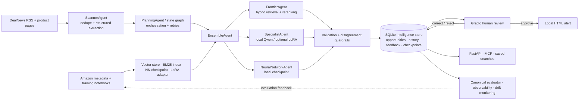

# The Price is Right

A local-first autonomous deal intelligence system. It scans current RSS deals,
uses Qwen through Ollama to select and price products, augments estimates with
similar products from Chroma, and publishes qualified opportunities to a local
Gradio dashboard.

## Architecture



The core path is **scan → retrieve/estimate → guard → persist → human review**.
Supporting subsystems add breadth without changing that path: the data and
training pipeline produces local model assets; Chroma tracks embeddings and seen
deal identity; SQLite is the durable control plane; LangGraph adds resumability;
Gradio, FastAPI, and MCP expose the same intelligence; and evaluation,
observability, tests, Docker, and CI measure and operate the system. `memory.json`
remains a compatibility snapshot, while SQLite is the evaluation source of truth.

No OpenAI, Claude, Pushover, or Modal credential is required by the active
dashboard workflow.

## Prerequisites

- Python 3.14 and the project virtual environment
- Ollama running locally
- The `qwen3.6:latest` Ollama model
- An NVIDIA CUDA GPU when using the optional fine-tuned specialist (about 2 GB VRAM)
- A populated `products_vectorstore` Chroma collection
- `artifacts/deep_neural_network.pth`

### Forking or cloning this repository

Large generated and third-party assets are intentionally not committed. A fresh
clone contains all application source, tests, configuration, and build scripts,
but you must provide or build `products_vectorstore/`, `products_bm25.sqlite3`,
and `artifacts/deep_neural_network.pth` before running the full dashboard.

Start with `uv sync`, install the configured Ollama model, then follow
`BUILD_DEEP_NEURAL_NETWORK.md` and `LOCAL_DEAL_ALERTS.md` for the local assets.
`AGENTIFY_PRICER_GUIDE.md` explains the complete architecture and training path;
`AGENTIFY_PRICER_TROUBLESHOOTING.md` covers common setup failures. Generated
checkpoints, adapters, datasets, vector stores, databases, and runtime logs
should remain outside Git.

Start Ollama and confirm the model is installed:

```powershell
ollama serve
ollama list
```

Build the neural-network checkpoint locally if it is missing:

```powershell
.\.venv\Scripts\python.exe .\train_deep_neural_network.py --epochs 5
```

Build the persistent BM25 sidecar after creating or replacing the Chroma product
collection. The application uses dense-only retrieval until this one-time build
has completed:

```powershell
.\.venv\Scripts\python.exe .\build_bm25_index.py
```

## Run the dashboard

### Expanded application quick start

### One-command end-to-end launch

From the repository root, run:

```powershell
& "C:\Program Files\Git\usr\bin\bash.exe" ./run_app.sh
```

Or, from a Git Bash terminal:

```bash
./run_app.sh
```

The launcher synchronizes dependencies, starts Ollama if necessary, pulls the
configured Qwen model if missing, validates the vector store, builds a missing
BM25 index or neural checkpoint, and starts the Gradio UI. Opening the page
starts the RSS feed scan; selecting a result exposes the human approval and
rejection controls. `uv`, Ollama, and the generated `products_vectorstore/`
must already be available because the vector store is intentionally not kept in
Git.

For a server without automatic browser opening:

```powershell
& "C:\Program Files\Git\usr\bin\bash.exe" ./run_app.sh --no-browser
```

The single command that starts the complete expanded dashboard is:

```powershell
.\.venv\Scripts\python.exe .\price_is_right.py
```

Before running it, make sure Ollama and the configured model are available:

```powershell
ollama serve
ollama list
```

`qwen3.6:latest` should appear in the model list. If Ollama is already running,
do not start a second server. The project also expects these local assets:

- `products_vectorstore/`
- `products_bm25.sqlite3`
- `artifacts/deep_neural_network.pth`

The application opens on `http://127.0.0.1:7860`. To start it without opening a
browser automatically, which is useful for a background process or remote host:

```powershell
$env:PRICER_OPEN_BROWSER="false"
.\.venv\Scripts\python.exe .\price_is_right.py
```

Saved opportunities appear immediately. Newly evaluated deals stream into the
table one at a time, and a failure is displayed in the status and log panels
instead of leaving the UI waiting indefinitely.

Opening the dashboard triggers the first scan automatically. The manual button
starts another scan on demand, and the timer checks again every five minutes.
With the local 23 GB Qwen model, a cold five-deal run can take several minutes;
results stream into the table as each deal completes.

The review panel shows a risk level, per-model estimates, an agreement-based
confidence interval, retrieved comparables, and price history. Approve/reject
decisions, estimate snapshots, corrected prices, reasons, and saved product
watches are persisted to `artifacts/pricer_intelligence.sqlite3` for continuous
evaluation. The evaluation scorecard reports approval rate, MAE, RMSE, and signed
bias without allowing a later rescan to rewrite the estimate that was reviewed.

### Dashboard walkthrough

1. **Startup:** the app loads `memory.json`, opens the Chroma product and
   seen-deal collections, initializes the SQLite intelligence store, and renders
   the saved opportunity table and product-similarity map.
2. **Start a scan:** opening the page starts the initial scan. Click **Run deal
   scan now** for an on-demand scan; a five-minute timer also requests scans and
   a run lock prevents overlapping execution.
3. **Collect deals:** `ScannerAgent` reads the configured DealNews RSS feeds,
   fetches product pages, canonicalizes URLs, removes duplicates, and excludes
   candidates already recorded in the persistent `seen_deals` collection.
4. **Select candidates:** local Qwen receives the unseen deal descriptions and
   returns validated `DealSelection` structured output. Successfully processed
   selected and rejected candidates are recorded so the next scan does not
   repeat them. Failed model calls remain retryable.
5. **Rewrite product text:** the preprocessor converts each selected deal into a
   compact product-focused query for the pricing agents.
6. **Retrieve evidence:** `FrontierAgent` performs dense Chroma retrieval and
   SQLite BM25 search. Conservative query variants preserve model identifiers;
   metadata filters can constrain category, brand, or condition. Reciprocal Rank
   Fusion combines the rankings and a cross-encoder reranks the candidates.
7. **Estimate with three models:** the RAG frontier model, specialist Qwen model,
   and local PyTorch neural network each produce a price. `EnsembleAgent` checks
   disagreement and computes the weighted estimate, confidence interval, model
   breakdown, evidence citations, and explanation.
8. **Apply deal guardrails:** the planner calculates absolute and percentage
   discount. More than `$50` estimated savings and at least a 20% discount are
   required before a deal enters the pending human-approval queue. A failure on
   one product is logged while remaining products continue.
9. **Stream and persist:** each result appears in the table immediately. The app
   atomically updates `memory.json` and records the opportunity, observed price,
   estimate, evidence, status, and timestamp in
   `artifacts/pricer_intelligence.sqlite3`.
10. **Select a review target:** choose a pending table row. Start with rows marked
    `High` review risk so low-confidence, weak-evidence, or high-disagreement
    results are inspected first.
11. **Verify the source:** open the original listing and confirm the exact model
    or SKU, condition, quantity, shipping, coupon or membership requirements,
    and final checkout price. Reject the result if any extracted fact is wrong.
12. **Inspect disagreement:** compare all three model estimates and the confidence
    interval. A narrow interval or high confidence is supporting information,
    not proof that the estimate is correct.
13. **Validate comparables:** confirm that at least three retrieved products are
    genuinely comparable in product class, specification, and condition. Ignore
    matches that only share generic wording.
14. **Establish an independent label:** research recent sold prices or several
    reputable retailers without anchoring on the model estimate. Enter that value
    as the corrected fair price so pricing error can be measured.
15. **Record the reasoning:** write a specific reason of at least ten characters,
    such as `Reject — refurbished unit was compared with new retail listings.`
16. **Make the decision:** **Approve and publish alert** creates the local alert;
    **Reject — do not alert** suppresses it. Both actions create a durable feedback
    record containing the estimate visible at decision time.
17. **Evaluate the system:** use the dashboard scorecard or `GET /evaluation` to
    inspect approval rate, MAE, RMSE, and signed bias. Positive bias means the
    system overvalues products; negative bias means it undervalues them. Treat
    results as preliminary until at least 30 independently corrected prices have
    been collected, and inspect errors separately by product category.
18. **Save a watch:** open **Saved deal searches**, enter a name and product
    query, optionally choose a category, and save it. Saved watches can be run
    through the API or MCP server against current opportunity history.

The live logs show each stage and the status banner reports ready, running,
complete, or failed state. Scanning and selecting never send a notification;
only an explicit human approval publishes a local alert.

### Other ways to run the expanded system

Dashboard only:

```powershell
.\.venv\Scripts\python.exe .\price_is_right.py
```

API with interactive documentation at `http://127.0.0.1:8000/docs`:

```powershell
.\.venv\Scripts\uvicorn.exe api:app --host 127.0.0.1 --port 8000
```

MCP server over stdio:

```powershell
.\.venv\Scripts\python.exe .\mcp_server.py
```

Containerized API:

```powershell
docker compose up --build
```

## Run the API

Copy `.env.example` to `.env`, set a strong `PRICER_API_KEY`, and start:

```powershell
.\.venv\Scripts\uvicorn.exe api:app --host 127.0.0.1 --port 8000
```

OpenAPI documentation is available at `http://127.0.0.1:8000/docs`. The API
provides deal scanning, manual estimates, opportunities, approval feedback,
price history and buy/wait insights, saved searches, metrics, and evaluation.
Except for `/health`, send the configured key in the `X-API-Key` header.

## Run MCP

The local MCP server exposes pricing, hybrid comparable search, opportunities,
human feedback, price history, and saved searches as agent tools:

```powershell
.\.venv\Scripts\python.exe .\mcp_server.py
```

`mcp_client.py` is a minimal stdio client that discovers the server tools and
calls `list_opportunities`.

## Resumable graph and multimodal retrieval

- `agents/state_graph.py` supplies a LangGraph workflow with guarded retry,
  durable checkpoints, confidence routing, and human approval/resume.
- `agents/multimodal.py` supplies lazy CLIP image/text encoders and a Chroma
  retriever for a dedicated image-embedding collection. Text-only operation
  remains the default, so no image model is loaded unless this feature is used.
- `pricer/monitoring.py` provides population-stability drift monitoring, while
  the intelligence store calculates feedback acceptance and corrected-price MAE.

## Container

The API can be built and run with `docker compose up --build`. Ollama remains on
the host and is reached at `host.docker.internal`; local artifact storage is
mounted into the container. The GitHub Actions workflow runs the complete unit
suite on pushes and pull requests.

## Configuration

All settings are optional:

| Variable | Default | Purpose |
|---|---|---|
| `PRICER_QWEN_MODEL` | `qwen3.6:latest` | Shared local Qwen model |
| `PRICER_SPECIALIST_BACKEND` | `ollama` | Use `finetuned` to enable the Qwen2.5 adapter |
| `PRICER_FINETUNED_BASE_MODEL` | `Qwen/Qwen2.5-3B-Instruct` | Fine-tuned specialist base model |
| `PRICER_FINETUNED_ADAPTER` | Local August 5 adapter, then Hub fallback | PEFT adapter path or Hub ID |
| `PRICER_SPECIALIST_MODEL` | `PRICER_QWEN_MODEL` | Model used only by the Ollama fallback |
| `PRICER_SCANNER_MODEL` | `qwen3.6:latest` | Scanner override |
| `PRICER_FRONTIER_MODEL` | `qwen3.6:latest` | RAG estimator override |
| `PRICER_RERANKER_MODEL` | `cross-encoder/ms-marco-MiniLM-L-6-v2` | Cross-encoder model; set to `off` to disable |
| `PRICER_BM25_PATH` | `products_bm25.sqlite3` | Persistent lexical index path |
| `PRICER_MAX_MODEL_SPREAD_RATIO` | `2.0` | Reject ensemble estimates with greater relative disagreement |
| `PRICER_JUDGE_MODEL` | `qwen3.6:latest` | Optional offline RAG judge model |
| `OLLAMA_API_BASE` | `http://localhost:11434` | Local Ollama endpoint |
| `PRICER_ALERT_DIR` | `artifacts` | Local alert output directory |

## Reliability behavior

- Each successfully priced deal is streamed to the dashboard immediately.
- A failure pricing one deal is logged and the remaining deals continue.
- Worker-level failures always emit a terminal UI event.
- Duplicate timer/button runs are rejected by a non-blocking run lock.
- Feed-local duplicates and tracking-parameter URL variants are collapsed.
- Every successfully scanned candidate is persisted in Chroma as selected or rejected.
- Failed scanner calls remain retryable because their candidates are not marked seen.
- Winning opportunity history is written atomically to `memory.json`.
- Alerts require both a discount greater than `$50` and a discount of at least 20%.
- Logs are HTML-escaped before rendering.
- Phone and cloud notification calls are disabled.

## AI and RAG concepts

The project currently implements:

- **Local LLM inference:** Qwen through Ollama, with an optional fine-tuned
  Qwen2.5 specialist adapter.
- **Embedding and dense retrieval:** MiniLM query embeddings search an
  800,000-product Chroma HNSW collection using its current L2 distance setting.
- **BM25 hybrid search:** SQLite FTS5 supplies lexical candidates, and Reciprocal
  Rank Fusion combines them with Chroma results.
- **Top-K retrieval and reranking:** dense and BM25 retrieval each return 20
  candidates; a cross-encoder reranks the fused set and selects five comparables.
- **RAG context injection:** selected product descriptions and prices are passed
  to local Qwen as evidence for its estimate.
- **RAG evaluation:** Precision@K, Recall@K, reciprocal rank, and nDCG utilities
  support labelled retrieval experiments.
- **LLM-as-judge:** an optional offline structured judge scores comparable-product
  relevance; actual prices remain the source of truth for price evaluation.
- **Advanced retrieval:** conservative multi-query expansion preserves product
  model numbers, while category/brand/condition metadata filters can constrain
  both dense and BM25 retrieval.
- **Explainability and calibration:** each opportunity records model estimates,
  confidence bounds, comparable citations, and a plain-language explanation.
- **Human feedback and continuous evaluation:** approvals, rejections, corrected
  prices, acceptance rate, corrected-price MAE, latency, errors, and drift can be
  monitored locally.
- **Guardrails:** structured output, URL and price validation, untrusted-input
  delimiters, ensemble-disagreement checks, and two-part alert thresholds.
- **Multi-agent orchestration:** scanner, preprocessing, retrieval, specialist,
  neural-network, planning, and messaging agents form the end-to-end workflow.

Partially covered or future concepts include multi-user approval workflows, an LLM gateway,
deployment authentication and authorization, metadata filters, context
compression, query expansion, multi-query or recursive retrieval, cosine-distance
evaluation, Self-RAG, Graph RAG, and multimodal RAG. Chunking and chunk overlap
are intentionally absent because each indexed product is currently a short,
atomic record rather than a long document.

## Tests

```powershell
$env:LITELLM_LOCAL_MODEL_COST_MAP='True'
.\.venv\Scripts\python.exe -m unittest discover -s tests -v
```

The 34-test regression suite covers hybrid retrieval, BM25 indexing, rank fusion,
reranking, retrieval metrics, LLM judging, price and alert guardrails, local model
routing and parsing, partial pricing failures, progress streaming, durable memory,
table conversion, worker error propagation, approval persistence, price insights,
confidence intervals, graph checkpoint/resume, API authentication, and drift metrics.
